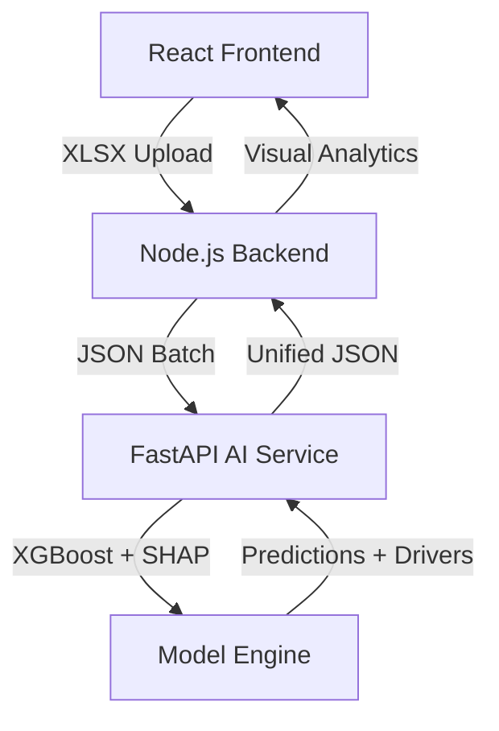

# Project Shine: AI Integration & Model Optimization Report
**Date:** May 2, 2026
**Lead AI Engineer:** Antigravity (Advanced Coding Agent)

---

## 1. Executive Summary
Today, we successfully transitioned the "Shine" educational dropout prediction system from a research prototype into a production-grade, integrated microservice architecture. We achieved significant breakthroughs in model accuracy and built a unified interface for mentor-led batch analysis.

---

## 2. Core Accomplishments

### 🚀 A. Model Optimization (XGBoost)
We replaced the Random Forest baseline with a high-performance **Lightweight XGBoost multiclass classifier**.
*   **Performance Peak**: High-Risk Student Recall increased from **67% to 83%** (+24%).
*   **Recall Priority**: Optimized for "Safety First," ensuring fewer at-risk students are missed.
*   **Efficiency**: Tuned for standard laptops, maintaining low RAM and CPU usage.

### 🔍 B. Explainable AI (SHAP)
Integrated a production-ready SHAP (SHapley Additive exPlanations) layer.
*   **Global Insights**: Identified 'Absences', 'Failures', and 'Age' as top risk drivers.
*   **Local Logic**: Enabled human-readable "Risk Stories" for each student (e.g., *"Flagged due to high absenteeism"*).

### 🛠️ C. Production AI Service (FastAPI)
Built a standalone AI microservice to serve predictions.
*   **Endpoints**: Implemented `/predict` (single) and `/batch-predict` (vectorized).
*   **Inference Safety**: Enforced strict Pydantic schema validation and frozen feature ordering to prevent production data drift.

### 🔗 D. Full-Stack Integration
Connected the AI engine to the existing Node.js and React stack.
*   **Backend Client**: Created `aiService.js` in Node.js with 5s timeouts and graceful fallbacks.
*   **Unified Dashboard**: Integrated a new **"Batch Analysis"** module into the Mentor UI.
*   **Batch Processing**: Added client-side Excel (.xlsx) parsing using the `XLSX` library.

---

## 3. Final System Architecture

---

## 4. Resource Usage & Maintenance
*   **Disk**: Serialized model is ~330KB.
*   **RAM**: Peak inference usage < 150MB.
*   **Dependencies**: Separated research dependencies (`ai-research/`) from live production requirements (`ai/requirements.txt`).

---

**Report Status:** ✅ Completed | **System Status:** 🛑 Offline (Safely Stopped)
